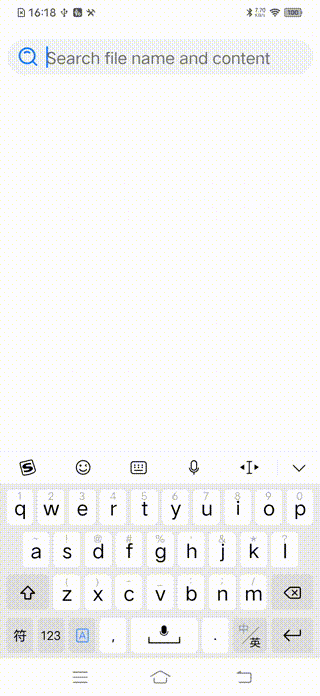
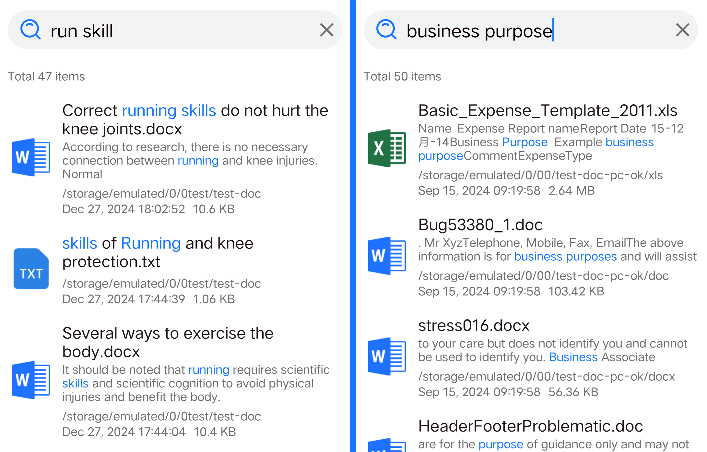
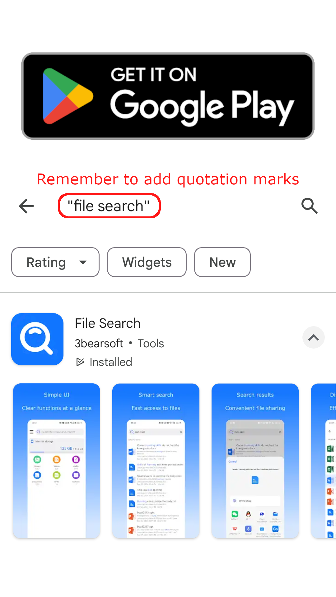

# File-Search
The best file search app on Android.   
  

You can quickly search for files without remembering the file name accurately. Thanks to its super fast search speed. It can output results while inputting. The search results will rank the files with high relevance in the front. It greatly saves the time of screening files. The keywords hit by the search results will be highlighted. Let you lock the key content in the file at a glance. In addition to being able to search for file names. You can also search for file contents. Let you find the required files smoothly even if you forget the file name.   
  

## Get it on Google Play  
[https://play.google.com/store/apps/details?id=com.bearsoft3.filesearch](https://play.google.com/store/apps/details?id=com.bearsoft3.filesearch)  

